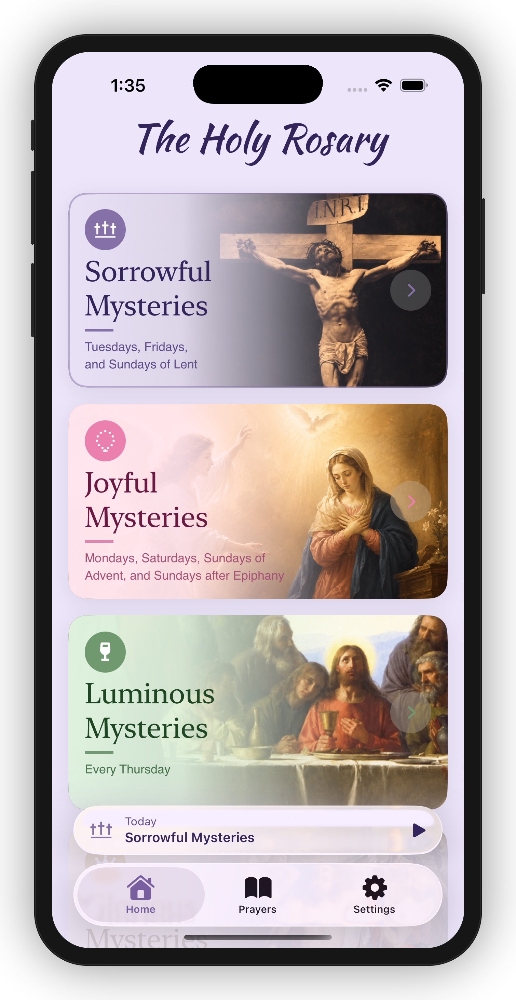
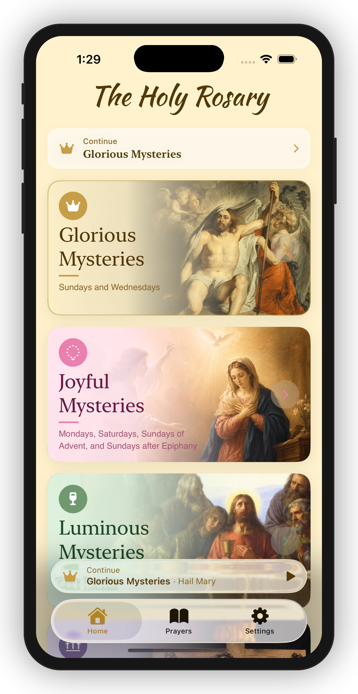
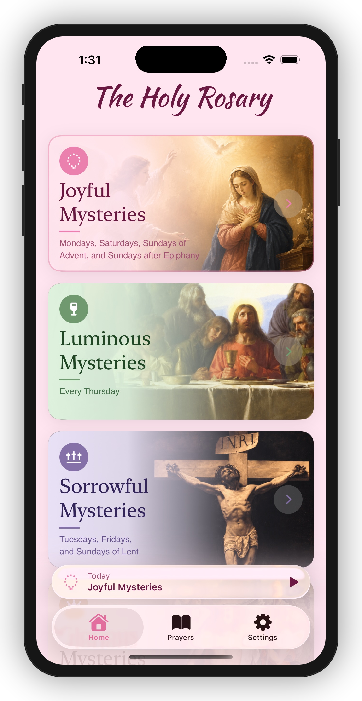
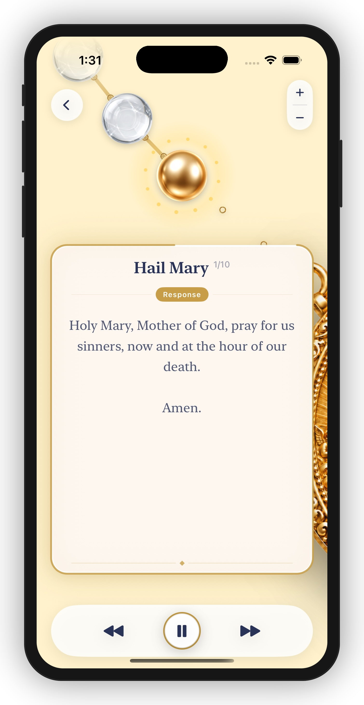
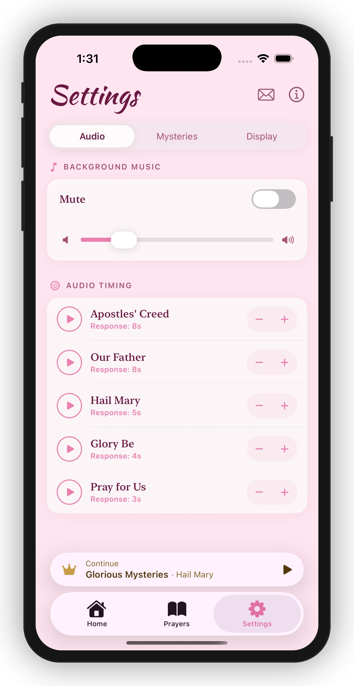
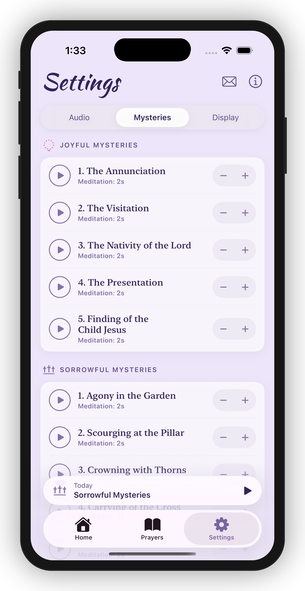

  

<h1 align="center">Mary's Rosary</h1>

A beautiful, audio-guided rosary app for iOS — pray the full Holy Rosary with voice, music, and text in perfect sync. Each mystery comes alive with its own immersive color theme, artwork, and atmosphere.

  
  
  

---

## Screenshots

  
  
  
  

  
  

---

## Features

### Immersive Themes Per Mystery
Every mystery has its own distinct color theme — backgrounds, accents, icons, and text colors all adapt automatically to reflect the mood and spirit of each mystery. Joyful is warm rose, Sorrowful is deep violet, Glorious is golden amber, Luminous is soft teal. The entire app transforms as you pray.

### Four Mysteries of the Rosary
Pray any of the four traditional mysteries, each with unique theming and classical artwork:

| Mystery | Days |
|---|---|
| **Joyful Mysteries** | Mondays, Saturdays, Sundays of Advent & Epiphany |
| **Sorrowful Mysteries** | Tuesdays, Fridays, Sundays of Lent |
| **Glorious Mysteries** | Wednesdays, Sundays (Ordinary Time) |
| **Luminous Mysteries** | Thursdays |

The app automatically selects the correct mystery for today using the full Catholic liturgical calendar, including Advent, Lent, and season-based Sunday overrides.

### All 20 Mysteries
Each mystery includes all five decades with their classical titles:

**Joyful:** The Annunciation · The Visitation · The Nativity · The Presentation · Finding of the Child Jesus

**Sorrowful:** Agony in the Garden · Scourging at the Pillar · Crowning with Thorns · Carrying of the Cross · The Crucifixion

**Glorious:** The Resurrection · The Ascension · Descent of the Holy Spirit · The Assumption · Coronation of the Blessed Virgin Mary

**Luminous:** Baptism of Jesus · Miracle at Cana · Proclamation of the Kingdom · The Transfiguration · Institution of the Eucharist

### Full Set of Traditional Prayers
- Sign of the Cross
- Apostles' Creed
- Our Father
- Hail Mary (×10 per decade)
- Glory Be
- Fatima Prayer
- Hail Holy Queen
- Closing Prayer
- For the Pope's Intentions

### Audio-Guided Prayer
- Full voice audio for every prayer, recorded in high-quality AAC (m4a)
- Audio and on-screen text are perfectly synchronized segment by segment
- Smooth `AVQueuePlayer` flat playlist — the entire rosary loads at session start for gapless playback
- Background ambient music with volume control and mute toggle

### Prayer Text Sync
- Each prayer is split into **Leader** and **Response** segments
- Responses are visually marked with a styled `RESPONSE` badge
- Text advances automatically in sync with the audio
- Progress bar tracks position within the current segment

### Resume & Session State
- A floating mini-bar shows today's mystery and your progress from any screen
- Leaving and returning shows a **Resume** screen with mystery name and last prayer bookmark
- **Continue** resumes exactly where you left off (correct bead and prayer)
- **Start Over** resets the session and restarts from the Sign of the Cross

### Rosary Bead Navigation
- Animated rosary bead visualization scrolls to highlight the current bead
- Beads are color-coded by type: crystal (Our Father / Glory Be), gold (Hail Mary), crucifix, centerpiece medal
- Hail Mary beads display a step counter (e.g. "3 / 10")
- **Skip forward / back** between any prayer segment

### Customizable Audio Timing
- Set a **response pause** (1–90 seconds) for each individual prayer to control how long the app waits before the response segment plays
- Separate **mystery meditation pause** per mystery type (default: 2 seconds)
- All delays persist across sessions via `UserDefaults`

### Display Settings
- **Zoom level** — adjustable rosary bead size
- **Prayer progress bar** toggle
- **Magic effect** toggle (ambient visual flourish)

---

## Planned Features

| Feature | Description |
|---|---|
| **Home Screen Widget** | Glanceable widget showing today's mystery with a one-tap shortcut to start praying |
| **Apple Watch** | Companion Watch app to follow along with the prayer session from your wrist |
| **CarPlay** | Audio-guided rosary playable directly from your car dashboard via CarPlay |

---

## Tech Stack

- **SwiftUI** with `@Observable` ViewModels
- **AVQueuePlayer** for flat audio playlist with preloaded segment durations
- **AVURLAsset** for synchronous local duration loading (no async desync)
- **Catholic Liturgical Calendar** — full Gregorian computus for Easter, Advent, Lent season detection
- `safeAreaInset` for floating control bar anchored to bottom safe area
- `PBXFileSystemSynchronizedRootGroup` — all source files auto-included by Xcode

---

## Requirements

- iOS 26+
- Xcode 16+
- Swift 6.2
